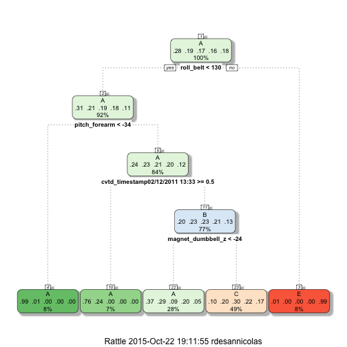

&nbsp;
&nbsp;
&nbsp;

## Overview

The goal will be to use data from accelerometers on the belt, forearm, arm, and dumbell of 6 participants. They were asked to perform barbell lifts correctly and incorrectly in 5 different ways. More information is available from the website here: http://groupware.les.inf.puc-rio.br/har (see the section on the Weight Lifting Exercise Dataset). 

The goal of this project is to predict the manner in which they did the exercise. This is the "classe" variable in the training set. This report is about how to built the predictive model, how we used cross validation, what we think the expected out of sample error is, and why we made the choices we did. We will also use our prediction model to predict 20 different test cases. 

&nbsp;

## Data

The training data for this project are available here: 

<https://d396qusza40orc.cloudfront.net/predmachlearn/pml-training.csv>

The test data are available here: 

<https://d396qusza40orc.cloudfront.net/predmachlearn/pml-testing.csv>

&nbsp;
&nbsp;
&nbsp;

## Libraries to load


```r
library(caret)
library(rattle)
```

&nbsp;

## Loading and preprocessing the data

First download the train and test sets from the url shown above. Then load the data with the code below.

```r
# download.file("https://d396qusza40orc.cloudfront.net/predmachlearn/pml-training.csv",destfile = "pml_train.csv",method = "curl")
train <- read.csv("pml_train.csv", header = TRUE)

# download.file("https://d396qusza40orc.cloudfront.net/predmachlearn/pml-testing.csv",destfile = "pml_test.csv",method = "curl")
test <- read.csv("pml_test.csv", header = TRUE)
```


```r
str(train)
```

```r
dim(train)
```

```
## [1] 19622   160
```
So we see that the train set is composed of 19622 observations, and 160 features.

Let's check for the NearZeroVariance variables and clean them.

```r
nsv <- nearZeroVar(train,saveMetrics=TRUE)
head(nsv)
```

```
##                      freqRatio percentUnique zeroVar   nzv
## X                     1.000000  100.00000000   FALSE FALSE
## user_name             1.100679    0.03057792   FALSE FALSE
## raw_timestamp_part_1  1.000000    4.26562022   FALSE FALSE
## raw_timestamp_part_2  1.000000   85.53154622   FALSE FALSE
## cvtd_timestamp        1.000668    0.10192641   FALSE FALSE
## new_window           47.330049    0.01019264   FALSE  TRUE
```

We are going to select all the variables with NearZeroVariance = TRUE and take them out from the data set.

```r
nsv_sub <- subset(nsv, nsv$nzv == TRUE)
nsv_names <- rownames(nsv_sub) # selecting the names of the variables

sub <- c()
for (i in 1:length(nsv_names)){
    sub <- c(sub, which(names(train) == nsv_names[i]))
} # sub is filled with the index of the columns corresponding to the names selected before

train_new1 <- train[,-sub] # removal of the selected columns
dim(train_new1)
```

```
## [1] 19622   100
```

Then we see that a lot of variables have a lot of NA values. We want to take those variables out of the training set as they are not going to be of any use predicting the response. We fix a threshold for the number of NA values in a variable at 70% of the total number of rows to determine if we are going to take out a variable or not.

```r
v <- c()
for (i in 1:ncol(train_new1)){
    if (sum(is.na(train_new1[,i])) >= 0.7 * nrow(train_new1) ) {
        v <- c(v, i) # v is filled with the index of the columns we want to remove
    }
}
train_new2 <- train_new1[,-v] # removal of the select columns
dim(train_new2)
```

```
## [1] 19622    59
```

Furthermore, we are going to take out the first variable, X, which only counts the rows, and may have unwilling influence on the algorithm we will use.


```r
train_new3 <- train_new2[,-1] # removing the first column
dim(train_new3)
```

```
## [1] 19622    58
```

We now have a training set of 58 variables, including the response `classe`.

Let's apply those transformations to the test set as well.

```r
test_new1 <- test[,-sub]
test_new2 <- test_new1[,-v]
test_new3 <- test_new2[,-1]
dim(test_new3)
```

```
## [1] 20 58
```

&nbsp;

## Splitting the training set

now we are going to split the training set into two sets. This way, we will be able to train a model on one set and calculate an out of sample error on the other set. ** (60% for the training set and 40% for the testing set) **

```r
set.seed(1)
inTrain <- createDataPartition(y=train_new3$classe, p=0.6, list=FALSE)
training <- train_new3[inTrain,]
testing <- train_new3[-inTrain,]
```

&nbsp;

## Training a model

As the probelm is a classification one, with 5 classes of output, we will try to fit a decision tree model or a random forest model on the data.
We first try with the decision tree, as it's computationally less demanding, and if the result, meaning the accuracy of the model, is not satisfactying, we will try to fit the random forest model.

&nbsp;

### Decision Tree

Now I'm going to fit a **decision tree model** to the training set.

```r
modFit <- train(classe ~ .,data=training,method="rpart")
pred <- predict(modFit,testing)
fancyRpartPlot(modFit$finalModel) # Plotting the decision tree
```



```r
confusionMatrix(pred, testing$classe)
```

```
## Confusion Matrix and Statistics
## 
##           Reference
## Prediction    A    B    C    D    E
##          A 1828  780  205  466  109
##          B    0    0    0    0    0
##          C  399  738 1163  820  686
##          D    0    0    0    0    0
##          E    5    0    0    0  647
## 
## Overall Statistics
##                                           
##                Accuracy : 0.4637          
##                  95% CI : (0.4526, 0.4748)
##     No Information Rate : 0.2845          
##     P-Value [Acc > NIR] : < 2.2e-16       
##                                           
##                   Kappa : 0.31            
##  Mcnemar's Test P-Value : NA              
## 
## Statistics by Class:
## 
##                      Class: A Class: B Class: C Class: D Class: E
## Sensitivity            0.8190   0.0000   0.8501   0.0000  0.44868
## Specificity            0.7221   1.0000   0.5920   1.0000  0.99922
## Pos Pred Value         0.5396      NaN   0.3056      NaN  0.99233
## Neg Pred Value         0.9094   0.8065   0.9493   0.8361  0.88949
## Prevalence             0.2845   0.1935   0.1744   0.1639  0.18379
## Detection Rate         0.2330   0.0000   0.1482   0.0000  0.08246
## Detection Prevalence   0.4318   0.0000   0.4851   0.0000  0.08310
## Balanced Accuracy      0.7706   0.5000   0.7211   0.5000  0.72395
```
As we can see, we get a very poor accuracy of about .49. That means that we have an **Out of Sample error** of 1 - 0.49 = 0.51 (very high).
The Out of Sample error is the error we can observe on a dataset not used to train the model, so here the test set partitioned from the total training set.
Furthermore, we haven't used here any cross-validation process.

We will try to fit a **random forest model**, and a cross-validation procss, to improve the accuracy.

&nbsp;

## Random Forest

We will use a 4 fold **cross-validation** when applying this algorithm

```r
modFit2 <- train(classe ~ .,data=training,method="rf", trControl = trainControl(method = "cv", 4, verboseIter = FALSE), ntree = 200)
pred2 <- predict(modFit2,testing)
confusionMatrix(pred2, testing$classe)
```

```
## Confusion Matrix and Statistics
## 
##           Reference
## Prediction    A    B    C    D    E
##          A 2232    1    0    0    0
##          B    0 1517    0    0    0
##          C    0    0 1368    0    0
##          D    0    0    0 1286    3
##          E    0    0    0    0 1439
## 
## Overall Statistics
##                                           
##                Accuracy : 0.9995          
##                  95% CI : (0.9987, 0.9999)
##     No Information Rate : 0.2845          
##     P-Value [Acc > NIR] : < 2.2e-16       
##                                           
##                   Kappa : 0.9994          
##  Mcnemar's Test P-Value : NA              
## 
## Statistics by Class:
## 
##                      Class: A Class: B Class: C Class: D Class: E
## Sensitivity            1.0000   0.9993   1.0000   1.0000   0.9979
## Specificity            0.9998   1.0000   1.0000   0.9995   1.0000
## Pos Pred Value         0.9996   1.0000   1.0000   0.9977   1.0000
## Neg Pred Value         1.0000   0.9998   1.0000   1.0000   0.9995
## Prevalence             0.2845   0.1935   0.1744   0.1639   0.1838
## Detection Rate         0.2845   0.1933   0.1744   0.1639   0.1834
## Detection Prevalence   0.2846   0.1933   0.1744   0.1643   0.1834
## Balanced Accuracy      0.9999   0.9997   1.0000   0.9998   0.9990
```
As we can see, we have now a very high accuracy of 99,9%, which mean that we have an **Out of Sample error** of 1 - 0.999 = 0.001. We are satisfied with this error rate and we want to try this model on the test set.

We are now going to apply this algorithm to the test set.

```r
predfin <- predict(modFit2,test_new3[,-58])
predfin
```

```
##  [1] B A B A A E D B A A B C B A E E A B B B
## Levels: A B C D E
```

&nbsp;

### Conclusion

By training two models, a Decision Tree, and a Random Forest, we obtained the following accuracies and **Out of Sample errors** :

- Decision Tree : accuracy = 0.049 -> **OoS error = 0.51**
- Random Forest : accuracy = 0.999 -> **OoS error = 0.001**

So we have decided to apply the Random Forest to the test set.

&nbsp;

### Submitting the answers

We will here write the txt files so that we can submit our answers.

```r
pml_write_files = function(x){
  n = length(x)
  for(i in 1:n){
    filename = paste0("problem_id_",i,".txt")
    write.table(x[i],file=filename,quote=FALSE,row.names=FALSE,col.names=FALSE)
  }
}

pml_write_files(predfin)
```
